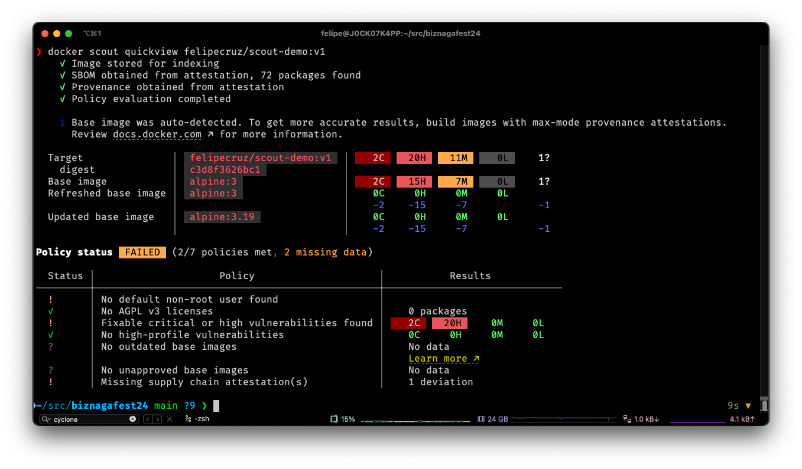
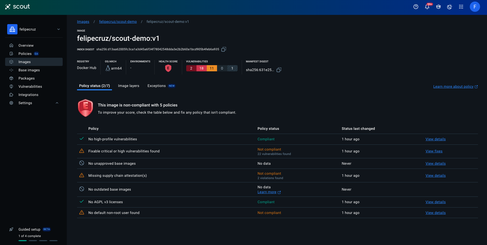
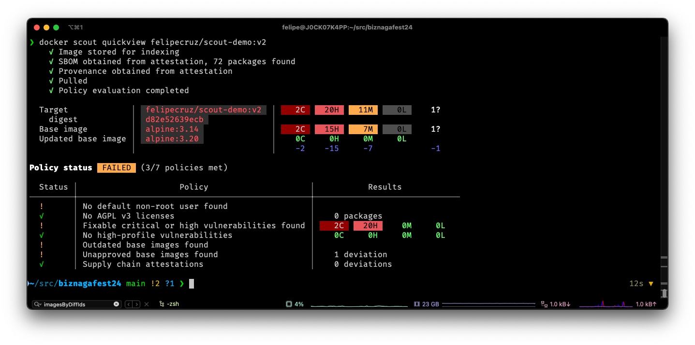
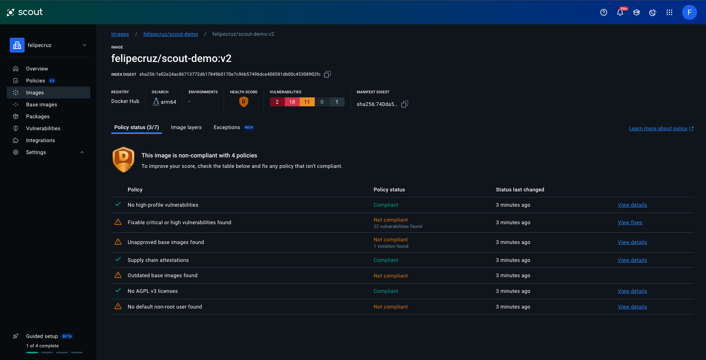
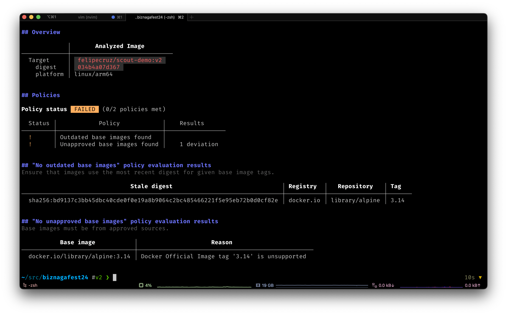
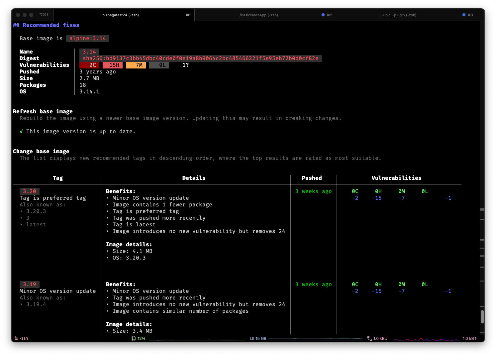
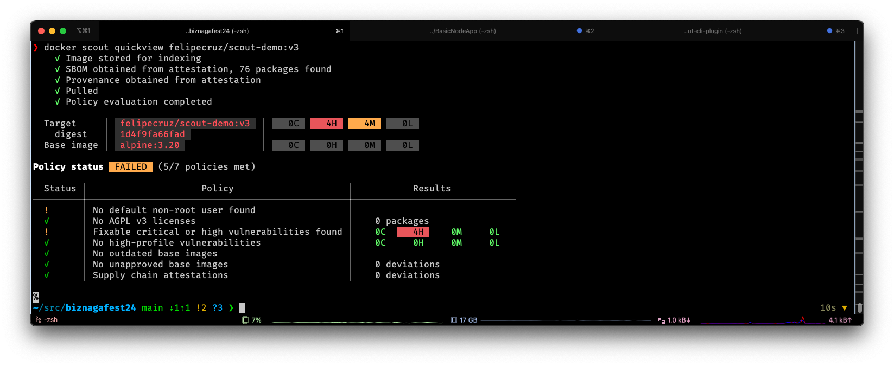
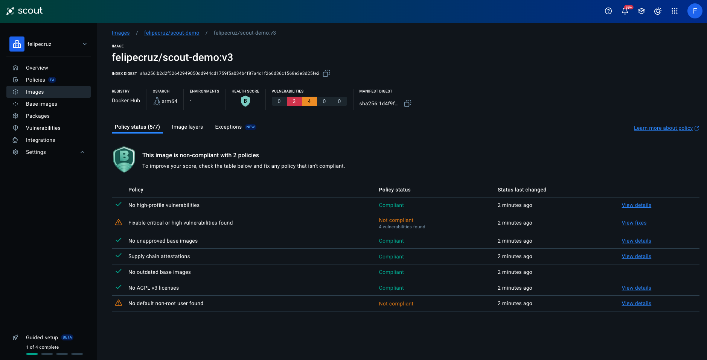

# Docker Scout Talk (BiznagaFest 2024)

Title: "Cómo proteger de forma proactiva las aplicaciones en contenedores con Docker Scout."

Slides: [Link](https://docs.google.com/presentation/d/1DOAvc0uEQ3jzQrTnJiWgo8f8WPFm0SJ8uUxuQauNavM/edit#slide=id.g30725f904bd_0_48).

Date: 26/10/2024.

Event: [BiznagaFest](https://www.biznagafest.com/) (Málaga, Spain).

## Introduction
This repo contains a basic ExpressJS app which uses an intentionally old version of Express and Alpine base image to demonstrate how to use Docker Scout to improve the security of your Docker images via security policies.

## Demo

In this demo we will show how to use Docker Scout to improve the security of a Docker image by following a set of security policies. These policies are defined in a Scout organization, so we need to configure the Scout CLI to use my organization:

```bash
docker scout config organization felipecruz
```

Let's build the Docker image:

```bash
docker build -t felipecruz/scout-demo:v1 .
```

### v1

To get a quick overview of the security of the image, we can use the `quickview` command:

```bash
docker scout quickview felipecruz/scout-demo:v1
```



The output is divided into two sections: the upper part shows a summary of CVEs for the image and its base image, and the lower part shows the status of the policy evaluations.

In the policy results we can see that the image has some critical, high and medium vulnerabilities. But there's also 2 policies that couldn't be evaluated because the image doesn't have a max-mode provenance attestation.

We can push the image to the registry and see the results in the Scout website:

```bash
docker build -t felipecruz/scout-demo:v1 --push .
```



## v2: Generate Supply Chain attestations

In this step we're going to generate the following attestations: SBOM and provenance. These attestations will allow Scout to evaluate the "Supply chain attestations" policy.

Let's simulate a code change in the `app.js` file and build a new image that contain SBOM and provenance attestations with the `--sbom=1` and `--provenance=mode=max` flags:

```bash
docker build -t felipecruz/scout-demo:v2 --sbom=1 --provenance=mode=max .
```

If we run the `quickview` command again, we can see that the image now has a SBOM and provenance attestation and thus the "Supply chain attestations" policy has passed.

```bash
✓      │ Supply chain attestations                      │    0 deviations
```



Let's push the image to the registry so we can see the attestations in the registry:

```bash
docker build -t felipecruz/scout-demo:v2 --sbom=1 --provenance=mode=max --push .
```

Visit https://explore.ggcr.dev/?image=felipecruz%2Fscout-demo%3Av2 to explore the contents of the image and navigate to the attestation manifest. It contains the SBOM and provenance attestations.

In the Scout UI we can see the results of the policy evaluations:



## v3: Update base image

As Scout is now able to identify what is the exact base image used in the Dockerfile, there are 2 policies that are failing:

- Outdated base images found.
- Unapproved base images found.

We can obtain more information about these policies by running the following command:

```bash
docker scout policy felipecruz/scout-demo:v2 --only-policy "Outdated base images found" --only-policy "Unapproved base images found"
```


The first policy tells us that the base image is outdated (there's a newer version of the base image available) and the second policy tells us that the base image is not approved by the organization because the tag is not supported.


Let's use the `recommendations` command to find out what recommendations for base images updates are available:

```bash
docker scout recommendations felipecruz/scout-demo:v2
```




The output shows that the preferred base image is `alpine:3.20` which results in removing all CVEs from the base image. Let's update the Dockerfile and build the new image:

```bash
docker build -t felipecruz/scout-demo:v3 --sbom=1 --provenance=mode=max .
```

If we run the `quickview` command again, we can see that the "Outdated base images found" policy has passed.

```bash
docker scout quickview felipecruz/scout-demo:v3
```



Let's push the image to the registry so we can see the results in the Scout website:

```bash
docker build -t felipecruz/scout-demo:v3 --sbom=1 --provenance=mode=max --push .
```

