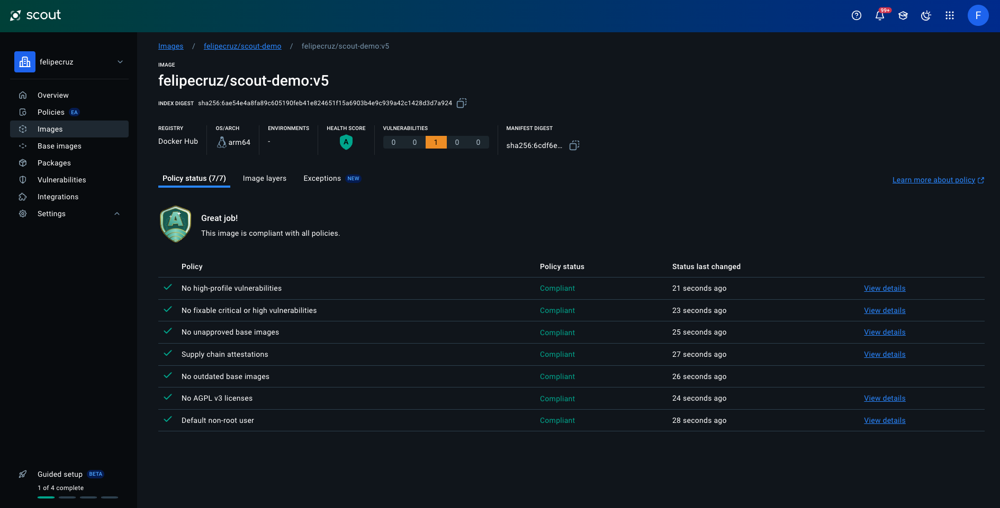

# Docker Scout Talk (BiznagaFest 2024)

Title: "Cómo proteger de forma proactiva las aplicaciones en contenedores con Docker Scout."

Slides: [Link](https://docs.google.com/presentation/d/1DOAvc0uEQ3jzQrTnJiWgo8f8WPFm0SJ8uUxuQauNavM/edit#slide=id.g30725f904bd_0_48).

Date: 26/10/2024.

Event: [BiznagaFest](https://www.biznagafest.com/) (Málaga, Spain).

## Table of contents
- [Docker Scout Talk (BiznagaFest 2024)](#docker-scout-talk-biznagafest-2024)
  - [Table of contents](#table-of-contents)
  - [Introduction](#introduction)
  - [v1](#v1)
  - [v2: Generate Supply Chain attestations](#v2-generate-supply-chain-attestations)
  - [v3: Update base image](#v3-update-base-image)
  - [v4: Run as non-root](#v4-run-as-non-root)
  - [v5: Fix critical or high vulnerabilities](#v5-fix-critical-or-high-vulnerabilities)
  - [Other resources](#other-resources)

## Introduction
This repo contains a basic ExpressJS app which uses an intentionally old version of Express and Alpine base image to demonstrate how to use Docker Scout to improve the security of your Docker images via security policies.

In this demo we will show how to use Docker Scout to improve the security of a Docker image by following a set of security policies. These policies are defined in a Scout organization, so we need to configure the Scout CLI to use my organization:

```bash
docker scout config organization felipecruz
```

## v1

Let's build the Docker image:

```bash
docker build -t felipecruz/scout-demo:v1 .
```

To get a quick overview of the security of the image, we can use the `quickview` command:

```bash
docker scout quickview felipecruz/scout-demo:v1
```


The output is divided into two sections: the upper part shows a summary of CVEs for the image and its base image, and the lower part shows the status of the policy evaluations.

In the policy results we can see that the image has some critical, high and medium vulnerabilities. But there's also 2 policies that couldn't be evaluated because the image doesn't have a max-mode provenance attestation.

We can push the image to the registry and see the results in the Scout website:

```bash
docker build -t felipecruz/scout-demo:v1 --push .
```


## v2: Generate Supply Chain attestations

In this step we're going to generate the following attestations: SBOM and provenance. These attestations will allow Scout to evaluate the "Supply chain attestations" policy.

Let's simulate a code change in the `app.js` file and build a new image that contain SBOM and provenance attestations with the `--sbom=1` and `--provenance=mode=max` flags:

```bash
docker build -t felipecruz/scout-demo:v2 --sbom=1 --provenance=mode=max .
```

If we run the `quickview` command again, we can see that the image now has a SBOM and provenance attestation and thus the "Supply chain attestations" policy has passed.

```bash
✓      │ Supply chain attestations                      │    0 deviations
```


Let's push the image to the registry so we can see the attestations in the registry:

```bash
docker build -t felipecruz/scout-demo:v2 --sbom=1 --provenance=mode=max --push .
```

Visit https://explore.ggcr.dev/?image=felipecruz%2Fscout-demo%3Av2 to explore the contents of the image and navigate to the attestation manifest. It contains the SBOM and provenance attestations.

In the Scout UI we can see the results of the policy evaluations:


## v3: Update base image

As Scout is now able to identify what is the exact base image used in the Dockerfile, there are 2 policies that are failing:

- Outdated base images found.
- Unapproved base images found.

We can obtain more information about these policies by running the following command:

```bash
docker scout policy felipecruz/scout-demo:v2 --only-policy "Outdated base images found" --only-policy "Unapproved base images found"
```


The first policy tells us that the base image is outdated (there's a newer version of the base image available) and the second policy tells us that the base image is not approved by the organization because the tag is not supported.


Let's use the `recommendations` command to find out what recommendations for base images updates are available:

```bash
docker scout recommendations felipecruz/scout-demo:v2
```


The output shows that the preferred base image is `alpine:3.20` which results in removing all CVEs from the base image. Let's update the Dockerfile and build the new image:

```bash
docker build -t felipecruz/scout-demo:v3 --sbom=1 --provenance=mode=max .
```

If we run the `quickview` command again, we can see that the "Outdated base images found" policy has passed.

```bash
docker scout quickview felipecruz/scout-demo:v3
```


Let's push the image to the registry so we can see the results in the Scout website:

```bash
docker build -t felipecruz/scout-demo:v3 --sbom=1 --provenance=mode=max --push .
```


## v4: Run as non-root

In this step we're going to define a non-root user that the container should run as. This will allow us to pass the "Run as non-root" policy.

Let's update the Dockerfile to define a non-root user and build the new image:

```diff
...
COPY . /app

+ RUN adduser -S appuser
+ RUN chown -R appuser /app
+ USER appuser

CMD ["node","/app/app.js"]
...
```

Now we can see that the "Run as non-root" policy has passed:

```bash
docker scout quickview felipecruz/scout-demo:v4
```


Let's push the image to the registry so we can see the results in the Scout website:

```bash
docker build -t felipecruz/scout-demo:v4 --sbom=1 --provenance=mode=max --push .
```


## v5: Fix critical or high vulnerabilities

In this step we're going to fix the critical and high vulnerabilities in the image. We can use the `cves` command to get a list of the vulnerabilities in the image:

```bash
docker scout cves felipecruz/scout-demo:v4
```
In the output below, we can see that there are 8 vulnerabilities in 6 packages:

```bash
✓ Image stored for indexing
 ✓ SBOM obtained from attestation, 76 packages found
 ✓ Provenance obtained from attestation
 ✓ Pulled
 ✗ Detected 6 vulnerable packages with a total of 7 vulnerabilities


## Overview

                 │                Analyzed Image
────────────────────┼────────────────────────────────────────────────
Target            │  felipecruz/scout-demo:v4
 digest          │  7003f869907c
 platform        │ linux/arm64/v8
 provenance      │ git@github.com:felipecruz91/biznagafest24.git
                 │  acd37043e08bc2525692452755b3dd2ab23fe5d1
 vulnerabilities │    0C     4H     4M     0L
 size            │ 33 MB
 packages        │ 76
                 │
Base image        │  alpine:3.20
                 │  9cee2b382fe2


## Packages and Vulnerabilities

0C     1H     2M     0L  express 4.17.1
pkg:npm/express@4.17.1

Dockerfile (14:17)
RUN  apk add --no-cache npm \
&& npm i --no-optional \
&& npm cache clean --force \
&& apk del npm

 ✗ HIGH CVE-2022-24999 [OWASP Top Ten 2017 Category A9 - Using Components with Known Vulnerabilities]
   https://scout.docker.com/v/CVE-2022-24999
   Affected range  : <4.17.3
   Fixed version   : 4.17.3
   CVSS Score      : 7.5
   CVSS Vector     : CVSS:3.1/AV:N/AC:L/PR:N/UI:N/S:U/C:N/I:N/A:H
   EPSS Score      : 1.95%
   EPSS Percentile : 89th percentile

 ✗ MEDIUM CVE-2024-43796 [Improper Neutralization of Input During Web Page Generation ('Cross-site Scripting')]
   https://scout.docker.com/v/CVE-2024-43796
   Affected range  : <4.20.0
   Fixed version   : 4.20.0
   CVSS Score      : 5.0
   CVSS Vector     : CVSS:3.1/AV:N/AC:H/PR:N/UI:R/S:U/C:L/I:L/A:L
   EPSS Score      : 0.05%
   EPSS Percentile : 18th percentile

 ✗ MEDIUM CVE-2024-29041 [Improper Validation of Syntactic Correctness of Input]
   https://scout.docker.com/v/CVE-2024-29041
   Affected range  : <4.19.2
   Fixed version   : 4.19.2
   CVSS Score      : 6.1
   CVSS Vector     : CVSS:3.1/AV:N/AC:L/PR:N/UI:R/S:C/C:L/I:L/A:N
   EPSS Score      : 0.04%
   EPSS Percentile : 11th percentile


0C     1H     0M     0L  body-parser 1.19.0
pkg:npm/body-parser@1.19.0

Dockerfile (14:17)
RUN  apk add --no-cache npm \
&& npm i --no-optional \
&& npm cache clean --force \
&& apk del npm

 ✗ HIGH CVE-2024-45590 [Asymmetric Resource Consumption (Amplification)]
   https://scout.docker.com/v/CVE-2024-45590
   Affected range  : <1.20.3
   Fixed version   : 1.20.3
   CVSS Score      : 7.5
   CVSS Vector     : CVSS:3.1/AV:N/AC:L/PR:N/UI:N/S:U/C:N/I:N/A:H
   EPSS Score      : 0.05%
   EPSS Percentile : 18th percentile


0C     1H     0M     0L  path-to-regexp 0.1.7
pkg:npm/path-to-regexp@0.1.7

Dockerfile (14:17)
RUN  apk add --no-cache npm \
&& npm i --no-optional \
&& npm cache clean --force \
&& apk del npm

 ✗ HIGH CVE-2024-45296 [Inefficient Regular Expression Complexity]
   https://scout.docker.com/v/CVE-2024-45296
   Affected range  : <0.1.10
   Fixed version   : 0.1.10
   CVSS Score      : 7.5
   CVSS Vector     : CVSS:3.1/AV:N/AC:L/PR:N/UI:N/S:U/C:N/I:N/A:H
   EPSS Score      : 0.04%
   EPSS Percentile : 16th percentile


0C     1H     0M     0L  qs 6.7.0
pkg:npm/qs@6.7.0

Dockerfile (14:17)
RUN  apk add --no-cache npm \
&& npm i --no-optional \
&& npm cache clean --force \
&& apk del npm

 ✗ HIGH CVE-2022-24999 [Improperly Controlled Modification of Object Prototype Attributes ('Prototype Pollution')]
   https://scout.docker.com/v/CVE-2022-24999
   Affected range  : >=6.7.0
                   : <6.7.3
   Fixed version   : 6.7.3
   CVSS Score      : 7.5
   CVSS Vector     : CVSS:3.1/AV:N/AC:L/PR:N/UI:N/S:U/C:N/I:N/A:H
   EPSS Score      : 1.95%
   EPSS Percentile : 89th percentile


0C     0H     1M     0L  send 0.17.1
pkg:npm/send@0.17.1

Dockerfile (14:17)
RUN  apk add --no-cache npm \
&& npm i --no-optional \
&& npm cache clean --force \
&& apk del npm

 ✗ MEDIUM CVE-2024-43799 [Improper Neutralization of Input During Web Page Generation ('Cross-site Scripting')]
   https://scout.docker.com/v/CVE-2024-43799
   Affected range  : <0.19.0
   Fixed version   : 0.19.0
   CVSS Score      : 5.0
   CVSS Vector     : CVSS:3.1/AV:N/AC:H/PR:N/UI:R/S:U/C:L/I:L/A:L
   EPSS Score      : 0.05%
   EPSS Percentile : 18th percentile


0C     0H     1M     0L  serve-static 1.14.1
pkg:npm/serve-static@1.14.1

Dockerfile (14:17)
RUN  apk add --no-cache npm \
&& npm i --no-optional \
&& npm cache clean --force \
&& apk del npm

 ✗ MEDIUM CVE-2024-43800 [Improper Neutralization of Input During Web Page Generation ('Cross-site Scripting')]
   https://scout.docker.com/v/CVE-2024-43800
   Affected range  : <1.16.0
   Fixed version   : 1.16.0
   CVSS Score      : 5.0
   CVSS Vector     : CVSS:3.1/AV:N/AC:H/PR:N/UI:R/S:U/C:L/I:L/A:L
   EPSS Score      : 0.05%
   EPSS Percentile : 21st percentile


8 vulnerabilities found in 6 packages
CRITICAL  0
HIGH      4
MEDIUM    4
LOW       0
```

By looking at our `package.json` we see the only direct dependency is `express`. Let's update the version of the `express` package to the highest version that is not affected by any of the vulnerabilities.

```diff
...
"dependencies": {
-  "express": "4.17.1"
+  "express": "4.20.0"
},
...
```

Now let's rebuild the image and analyze it again.

```bash
docker build -t felipecruz/scout-demo:v5 --sbom=1 --provenance=mode=max .
```

```bash
docker scout quickview felipecruz/scout-demo:v5
```



Now we have no fixable or critical vulnerabilities in our image. Let's push this image to Docker Hub.

```bash
docker build -t felipecruz/scout-demo:v5 --sbom=1 --provenance=mode=max --push .
```

:tada: Our image is now compliant with all policies and its score is the highest - a shiny `A`! :tada:

Bonus:

Use the `compare` command to compare the first and latest image versions and see the improvements:

```bash
docker scout compare felipecruz/scout-demo:v5 --to felipecruz/scout-demo:v1
```

## Other resources

- [Enhancing Your GitHub Workflow with Docker Scout](https://www.felipecruz.es/enhancing-your-github-workflow-with-docker-scout/)
